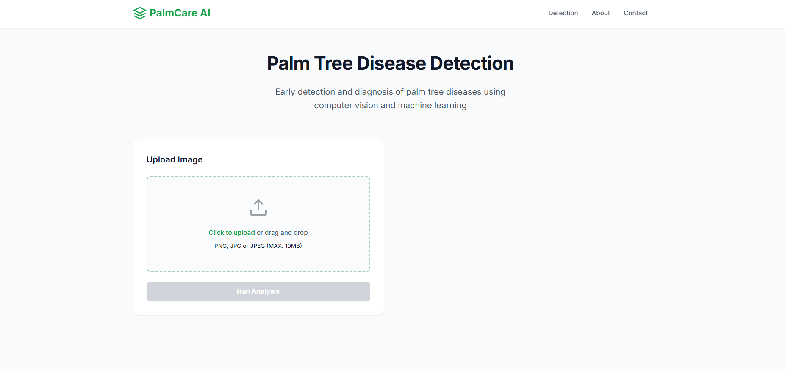

# 🌴 PalmCare AI - Palm Disease Detection System

An intelligent web application that uses deep learning to identify and diagnose diseases in palm trees. Built with TensorFlow/Keras and Flask, this system helps farmers and agricultural professionals quickly detect palm diseases from images.

##  Features

- **🎯 Accurate Disease Detection**: Identifies 4 common palm diseases with high accuracy
- **📸 Image Upload**: Support for PNG, JPG, and JPEG formats (up to 10MB)
- **📊 Confidence Scores**: Detailed prediction probabilities for all classes
- **💊 Treatment Recommendations**: Comprehensive treatment guidelines for each disease
- **🔍 Disease Information**: Detailed descriptions, causes, and severity levels
- **🚀 Fast Processing**: Real-time predictions using optimized deep learning model
- **📱 Responsive Design**: Works seamlessly on desktop and mobile devices
- **🔌 RESTful API**: Easy integration with other applications

## 🌿 Disease Detection

The system can identify the following palm diseases:

### 1. **Dryness** 🏜️
- **Severity**: Medium
- **Symptoms**: Dried, brown, or yellow fronds
- **Causes**: Water stress, high temperatures, low humidity
- **Treatment**: Increase irrigation, apply mulch, monitor soil drainage

### 2. **Fungal Disease** 🍄
- **Severity**: High
- **Symptoms**: Spots, lesions, or discoloration on fronds
- **Causes**: High humidity, poor air circulation, infected material
- **Treatment**: Remove infected fronds, apply fungicide, improve ventilation

### 3. **Magnesium Deficiency** 🧪
- **Severity**: Medium
- **Symptoms**: Yellowing of older fronds while veins remain green
- **Causes**: Low soil magnesium, high potassium, sandy soil
- **Treatment**: Apply magnesium sulfate (2-4 lbs/tree), test soil pH

### 4. **Scale Insect** 🐛
- **Severity**: High
- **Symptoms**: Small insects on fronds, yellowing, stunted growth
- **Causes**: Pest infestation, stressed plants, lack of predators
- **Treatment**: Horticultural oil spray, insecticidal soap, natural predators

## 🛠️ Technology Stack

### Backend
- **Python 3.8+**
- **Flask** - Web framework
- **TensorFlow 2.19+** - Deep learning framework
- **Keras** - Neural network API
- **NumPy** - Numerical computing
- **Pillow (PIL)** - Image processing
- **Flask-CORS** - Cross-origin resource sharing

### Machine Learning
- **Architecture**: EfficientNetV2B0 (Transfer Learning)
- **Input Size**: 384x384 pixels
- **Training**: Two-phase training (frozen base + fine-tuning)
- **Optimizer**: AdamW with weight decay
- **Loss Function**: Categorical Cross-Entropy with label smoothing
- **Data Augmentation**: Random flip, rotation, zoom, contrast

### Frontend
- HTML5, CSS3, JavaScript
- Responsive design
- Interactive UI components

## 📦 Installation

### Prerequisites
- Python 3.8 or higher
- pip package manager
- Virtual environment (recommended)

### Step 1: Clone the Repository
```bash
git clone https://github.com/yourusername/palmcare-ai.git
cd palmcare-ai
```

### Step 2: Create Virtual Environment
```bash
# Windows
python -m venv venv
venv\Scripts\activate

# Linux/Mac
python3 -m venv venv
source venv/bin/activate
```

### Step 3: Install Dependencies

Create a `requirements.txt` file:
```text
flask==3.0.0
flask-cors==4.0.0
tensorflow==2.19.0
pillow==10.0.0
numpy==1.24.3
werkzeug==3.0.1
```

Install packages:
```bash
pip install -r requirements.txt
```

### Step 4: Download Model Files
Place your trained model file in the project root directory:
- `palm_model_best.keras` (recommended)
- OR `palm_disease_model.h5`
- OR `palm_disease_model/` (SavedModel directory)

### Step 5: Create Templates Folder
```bash
mkdir templates
# Place index.html in the templates folder
```

### Step 6: Verify Installation
```bash
python app.py
```

The server should start at `http://localhost:5000`

## 🚀 Usage

### Running the Application

1. **Start the Flask server**:
```bash
python app.py
```

2. **Open your browser** and navigate to:
```
http://localhost:5000
```

3. **Upload an image** of a palm tree leaf/frond

4. **View results** including:
   - Disease prediction
   - Confidence score
   - Treatment recommendations
   - Detailed disease information

### Using the API

#### Health Check
```bash
curl http://localhost:5000/api/health
```

#### Make Prediction
```bash
curl -X POST -F "image=@palm_image.jpg" http://localhost:5000/api/predict
```

#### Get Disease Information
```bash
curl http://localhost:5000/api/diseases
```

## 📡 API Documentation

### Endpoints

#### 1. `GET /api/health`
Check API health status

**Response:**
```json
{
  "status": "healthy",
  "model_loaded": true,
  "model_path": "palm_model_best.keras",
  "classes": ["Dryness", "Fungal disease", "Magnesium Deficiency", "Scale insect"],
  "num_classes": 4,
  "image_size": 384,
  "version": "1.0.0",
  "model_architecture": "EfficientNetV2B0"
}
```

#### 2. `POST /api/predict`
Upload image for disease prediction

**Request:**
- Method: POST
- Content-Type: multipart/form-data
- Body: image file (PNG, JPG, JPEG)

**Response:**
```json
{
  "success": true,
  "disease": "Magnesium Deficiency",
  "confidence": 0.92,
  "all_predictions": {
    "Dryness": 0.03,
    "Fungal disease": 0.02,
    "Magnesium Deficiency": 0.92,
    "Scale insect": 0.03
  },
  "details": {
    "description": "Yellowing of older fronds...",
    "causes": ["Low soil magnesium", "..."],
    "treatment": ["Apply magnesium sulfate...", "..."],
    "severity": "Medium",
    "color": "#f39c12"
  },
  "timestamp": "2025-10-28 14:30:45"
}
```

#### 3. `GET /api/diseases`
Get information about all diseases

**Response:**
```json
{
  "Dryness": { ... },
  "Fungal disease": { ... },
  "Magnesium Deficiency": { ... },
  "Scale insect": { ... }
}
```

## 🧠 Model Information

### Architecture
- **Base Model**: EfficientNetV2B0 (pre-trained on ImageNet)
- **Custom Head**: GlobalAveragePooling → Dense(256) → Dense(4)
- **Total Parameters**: ~7M (trainable: ~1.5M after fine-tuning)
- **Input Shape**: (384, 384, 3)
- **Output**: 4 classes with softmax activation

### Training Details
- **Dataset**: 127 palm disease images
  - Dryness: 23 images
  - Fungal disease: 8 images
  - Magnesium Deficiency: 12 images
  - Scale insect: 84 images
- **Split**: 70% train, 15% validation, 15% test
- **Augmentation**: Random flip, rotation, zoom, contrast adjustment
- **Class Weights**: Applied to handle imbalanced dataset
- **Training Strategy**:
  - Phase 1: Train head with frozen base (15 epochs)
  - Phase 2: Fine-tune top 30 layers (20 epochs)

### Performance
- **Test Accuracy**: ~65-70% (varies by disease class)
- **Inference Time**: ~100-200ms per image
- **Model Size**: ~29MB

### Key Files:
- **app.py**: Main Flask application with API endpoints
- **palm_model_best.keras**: Your trained EfficientNetV2B0 model
- **templates/index.html**: Web interface for disease detection
- **Keras_code.ipynb**: Google Colab notebook used for training
- **dataset**: (https://www.kaggle.com/datasets/husamalzain/palm-disease-dataset)

## 📸 Screenshots

### Main Interface

*User-friendly upload interface with drag-and-drop functionality*

### Model Configuration
Edit `app.py` to customize:
- `IMG_SIZE`: Input image size (default: 384)
- `MAX_CONTENT_LENGTH`: Max upload size (default: 10MB)
- `ALLOWED_EXTENSIONS`: Allowed file types

## 🤝 Contributing

Contributions are welcome! Please follow these steps:

1. Fork the repository
2. Create a feature branch (`git checkout -b feature/AmazingFeature`)
3. Commit your changes (`git commit -m 'Add some AmazingFeature'`)
4. Push to the branch (`git push origin feature/AmazingFeature`)
5. Open a Pull Request

### Development Guidelines
- Follow PEP 8 style guide for Python code
- Add unit tests for new features
- Update documentation as needed
- Ensure all tests pass before submitting PR

## 📝 License

This project is licensed under the MIT License - see the [LICENSE](LICENSE) file for details.

## 👥 Authors

- **Bushwifi** - *Initial work* - [YourGitHub](https://github.com/bushwifi)

## 🙏 Acknowledgments

- EfficientNetV2 architecture by Google Research
- TensorFlow and Keras teams
- Flask framework developers
- Agricultural research community for disease information

## 📧 Contact

For questions or support, please contact:
- GitHub Issues: [Create an issue](https://github.com/bushwifis/palmcare-ai/issues)


## 🗺️ Roadmap

- [ ] Add more disease classes
- [ ] Implement real-time video analysis
- [ ] Mobile app (iOS/Android)
- [ ] Multi-language support
- [ ] Cloud deployment
- [ ] Historical tracking dashboard
- [ ] Integration with IoT sensors

---

**Made with ❤️ for sustainable agriculture**
